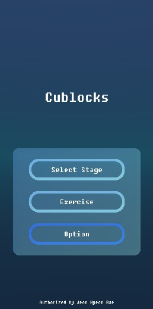
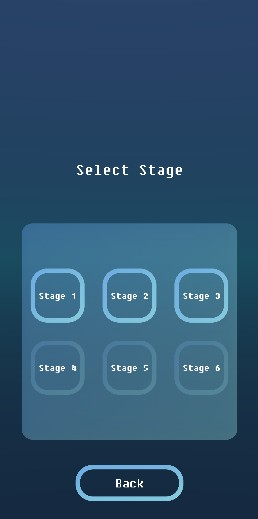

# Cubreak
> Unity Project

> 3D Puzzle

## Rules
#### Destroy blocks connected to the same color
#### Swipe left and right to see the side and back of the block chunk

## Features
### Stages
The game consists of a total of 6 stages. If all blocks destroyed then the stage is cleared.

### Customized Stage
You can set your own stage with some variables

> Present Speed: the falling speed of block

> Cube Model: the kind of initial cube

> Number of colors: the number of colors blocks can take

### See through
You can see inside of cube with 'See Through' button at the bottom of the middle. Once pressed, blocks other than those located inside become transluent so that the colors of the inner blocks can be known.

### Playing Video

